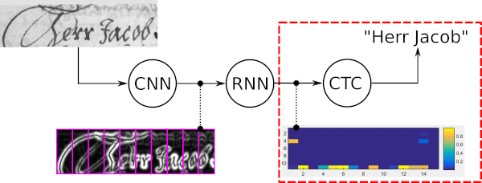
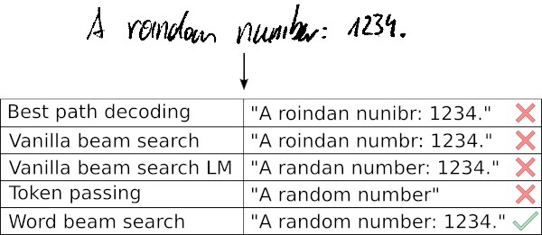

# CTC Word Beam Search Decoding Algorithm

* **Update 2024: Support Python versions 3.11 and 3.12**
* **Update 2021: Python package is the default way of installation**
* **Update 2020: installable Python package**

Connectionist Temporal Classification (CTC) decoder with dictionary and Language Model (LM). 

## Installation

* Go to the root level of the repository
* Execute `pip install .`
* Go to `tests/` and execute `pytest` to check if installation worked


## Usage

The following toy example shows how to use word beam search.
The hypothetical model (e.g. a text recognition model) is able to recognize 3 different characters: 
"a", "b" and " " (whitespace).
Words in that toy example can contain the characters "a" and "b" (but not " " which is the word separator).
The language model is trained from a text corpus which contains only two words: "a" and "ba".

In this code snippet an instance of word beam search is created, 
and a TxBx(C+1) shaped numpy array is decoded:

```python
import numpy as np
from word_beam_search import WordBeamSearch

corpus = 'a ba'  # two words "a" and "ba", separated by whitespace
chars = 'ab '  # the characters that can be recognized (in this order)
word_chars = 'ab'  # characters that form words

# RNN output
# 3 time-steps and 4 characters per time time ("a", "b", " ", CTC-blank)
mat = np.array([[[0.9, 0.1, 0.0, 0.0]], 
                [[0.0, 0.0, 0.0, 1.0]],
                [[0.6, 0.4, 0.0, 0.0]]]) 

# initialize word beam search (only do this once in your code)
wbs = WordBeamSearch(25, 'Words', 0.0, corpus.encode('utf8'), chars.encode('utf8'), word_chars.encode('utf8'))

# compute label string
label_str = wbs.compute(mat)
```

The decoder returns a list with a decoded label string for each batch element.
To finally get the character strings, map each label to its corresponding character:

````python
char_str = []  # decoded texts for batch
for curr_label_str in label_str:
    s = ''.join([chars[label] for label in curr_label_str])
    char_str.append(s)
````

Examples:
* Both this toy example and a real text recognition example can be found in `tests/test_word_beam_search.py` 
* The [SimpleHTR](https://github.com/githubharald/SimpleHTR) repository implements a handwritten text recognition system and optionally uses word beam search 


## Documentation of parameters

Parameters of the constructor of the `WordBeamSearch` class:
* Beam Width (beam_width): number of beams which are kept per time-step
* Scoring mode (lm_type): pass one of the four strings (not case-sensitive). The runtime with respect to the dictionary size W is given.
    * "Words": only use dictionary, no scoring: O(1)
    * "NGrams": use dictionary and score beams with LM: O(log(W))
    * "NGramsForecast": forecast (possible) next words and apply LM to these words: O(W*log(W))
    * "NGramsForecastAndSample": restrict number of (possible) next words to at most 20 words: O(W)
* Smoothing (lm_smoothing): LM uses add-k smoothing to allow word pairs which are not known from the training text, i.e. for which the bigram probability is zero. Set to values between 0 and 1, e.g. 0.01. To disable smoothing, set to 0
* Text (corpus): is given as a UTF8 encoded string. The operation creates its dictionary and (optionally) LM from it
* Characters (chars): is given as a UTF8 encoded string. If the number of characters is C, then the RNN output must have the size TxBx(C+1) with the last entry representing the CTC-blank label. The ordering of the characters must correspond to the ordering in the RNN output, e.g. if the RNN outputs the probabilities for "a", "b", " " and CTC-blank in this order, then the string "ab " must be passed
* Word characters (word_chars): is given as a UTF8 encoded string. Define how the algorithm extracts words from the text. If the word characters are "ab", and the text "aa ab bbb a" is passed, then the words "aa", "ab" and "bbb" will be extracted and used for the dictionary and the LM. To be able to recognize multiple words (e.g. a text-line), the word characters must be a subset of the characters recognized by the RNN (i.e. there must be at least one word-separating character like the space character): ```0<len(wordChars)<len(chars)```. In case only single words have to be detected, there is no need for a separating character, therefore the two parameters may also be equal: ```0<len(wordChars)<=len(chars)```

Input to the `WordBeamSearch.compute` method:
* Input matrix (mat)
  * numpy array
  * shape TxBx(C+1)
  * T is the number of time-steps, B the number of batch elements and C the number of characters
  * softmax-function already applied
  * CTC-blank must be the last entry along the character dimension in the matrix
  

## Algorithm

Word beam search is a CTC decoding algorithm.
It is used for sequence recognition tasks like handwritten text recognition or automatic speech recognition.



The four main properties of word beam search are:

* Words constrained by dictionary
* Allows arbitrary number of non-word characters between words (numbers, punctuation marks)
* Optional word-level Language Model (LM)
* Faster than token passing

The following sample shows a typical use-case of word beam search along with the results given by five different decoders.
Best path decoding and vanilla beam search get the words wrong as these decoders only use the noisy output of the optical model.
Extending vanilla beam search by a character-level LM improves the result by only allowing likely character sequences.
Token passing uses a dictionary and a word-level LM and therefore gets all words right.
However, it is not able to recognize arbitrary character strings like numbers.
Word beam search is able to recognize the words by using a dictionary, but it is also able to correctly identify the non-word characters.




More information:
* A short overview is given in the [poster](doc/poster.pdf)
* More details can be found in the [ICFHR 2018 paper](https://repositum.tuwien.at/retrieve/1835)


## Extras

* Python prototype: `extras/prototype/`
* TensorFlow custom operation: `extras/tf/`


## Citation

Please cite the following [paper](https://repositum.tuwien.at/retrieve/1835) if you are using word beam search in your research work.
```text
@inproceedings{scheidl2018wordbeamsearch,
	title = {Word Beam Search: A Connectionist Temporal Classification Decoding Algorithm},
	author = {Scheidl, H. and Fiel, S. and Sablatnig, R.},
	booktitle = {16th International Conference on Frontiers in Handwriting Recognition},
	pages = {253--258},
	year = {2018},
	organization = {IEEE}
}

```

## References

* [Word Beam Search: A CTC Decoding Algorithm](https://towardsdatascience.com/b051d28f3d2e)
* [Beam Search Decoding in CTC-trained Neural Networks](https://towardsdatascience.com/5a889a3d85a7)
* [Scheidl - Handwritten Text Recognition in Historical Documents](https://repositum.tuwien.ac.at/obvutwhs/download/pdf/2874742)
* [Scheidl - Word Beam Search: A Connectionist Temporal Classification Decoding Algorithm](https://repositum.tuwien.ac.at/obvutwoa/download/pdf/2774578)
